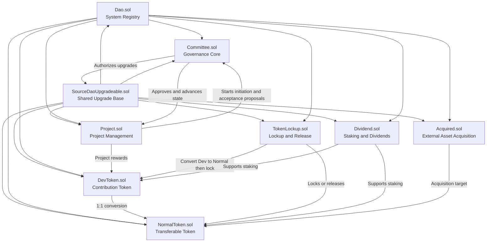
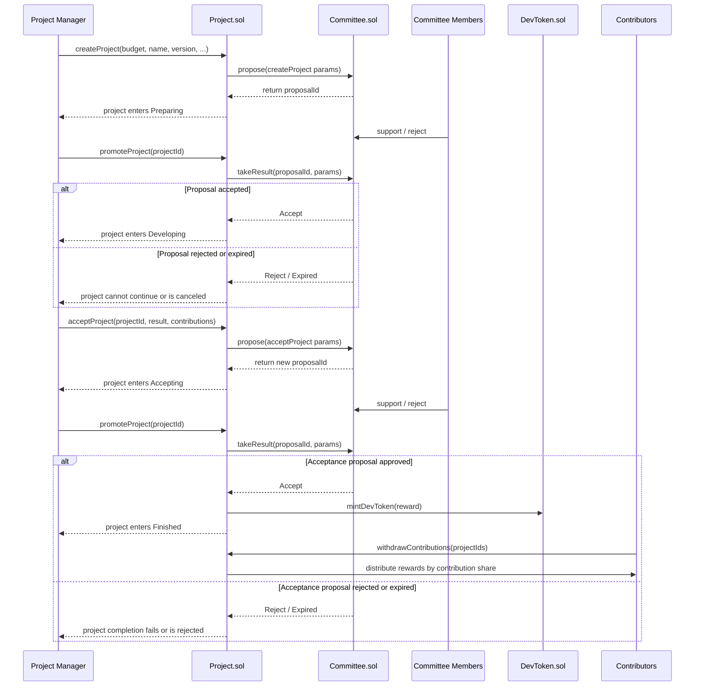
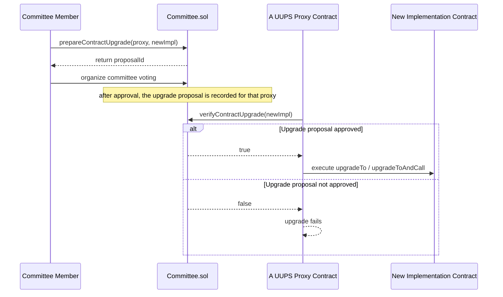

# SourceDAO Architecture Overview

This document summarizes the module boundaries, governance flow, and operational loop of SourceDAO based on the current primary implementation in the repository.

The `contracts/` directory should be treated as the main source of truth. Historical naming and older flows still exist in `old_contracts/`, some files under `scripts/`, and some files under `test/`, and should be read separately from the current architecture.

## 1. System Positioning

SourceDAO is not just a voting system. It is an on-chain governance and incentive framework designed for open source organizations. It tries to integrate the following behaviors into one coordinated contract system:

- Committee governance
- Full-community voting
- Open source project initiation and acceptance
- Contribution reward distribution
- Two-layer tokenized rights
- Investment lockup and linear release
- Revenue sharing
- Governance-driven contract upgrades

## 2. Module Breakdown

### Control Layer

- `Dao.sol`: the system registry that stores module addresses and exposes `isDAOContract` to restrict internal module calls.
- `SourceDaoUpgradeable.sol`: the shared UUPS upgrade base contract used by all major modules.

### Governance Layer

- `Committee.sol`: the governance core responsible for regular proposals, full-community proposals, committee member management, DevToken weight adjustment, and contract upgrade authorization.

### Production Layer

- `Project.sol`: manages the full project lifecycle, including initiation, development, acceptance, contribution recording, and reward settlement.

### Asset Layer

- `DevToken.sol`: a contribution-oriented token with restricted transfer paths.
- `NormalToken.sol`: a freely transferable token converted from DevToken on a 1:1 basis.
- `TokenLockup.sol`: the lockup and release module for early investment and special allocations.
- `Dividend.sol`: the staking and dividend distribution module.
- `Acquired.sol`: the module for acquiring DAO NormalToken with external assets.

## 3. Module Relationship Diagram

## 4. Core Governance Principles

### Two proposal modes

- Regular proposals: voted on by committee members with majority rule.
- Full-community proposals: voted on by token weight, where NormalToken counts 1:1 and DevToken is weighted by `devRatio`.

### Projects are proposal-driven, not directly executed

Neither project initiation nor project acceptance is completed unilaterally by a project manager. Both actions start from a proposal and only move forward after governance approval.

### Upgrades are governance-controlled, not owner-controlled

All major modules inherit from the shared upgrade base, and every upgrade must pass committee verification before execution.

### DevToken and NormalToken have different roles

- DevToken represents contribution rights.
- NormalToken represents transferable rights.
- DevToken cannot circulate like a normal ERC20 token.

## 5. Project Governance Sequence Diagram

The following sequence diagram describes the most important business loop in SourceDAO: how an open source project moves from initiation to acceptance and then to reward settlement.

## 6. Post-Release Convergence

Once a formal version of the main project is released, the system enters a more constrained phase:

- `TokenLockup.sol` can begin linearly releasing locked tokens over 6 months.
- The DevToken voting weight in `Committee.sol` converges to its final value and becomes fixed after the final version is released.
- The lockup contract is no longer suitable for receiving new lockup batches.

This means SourceDAO is not a static governance system. It encodes the organizational transition from an early construction stage to a formal release stage directly into its contracts.

## 7. Upgrade Governance Sequence Diagram

In addition to project governance, upgrade governance is another key mechanism in SourceDAO.

## 8. Suggested Reading Order

Recommended reading order for deeper review:

1. `docs/NewSourceDao.md`
2. `contracts/Dao.sol`
3. `contracts/Committee.sol`
4. `contracts/Project.sol`
5. `contracts/DevToken.sol`
6. `contracts/TokenLockup.sol`
7. `contracts/Dividend.sol`