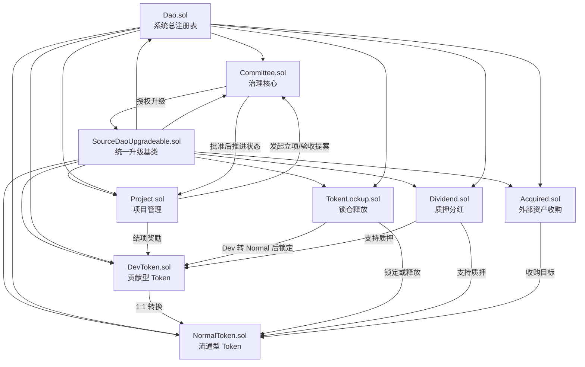
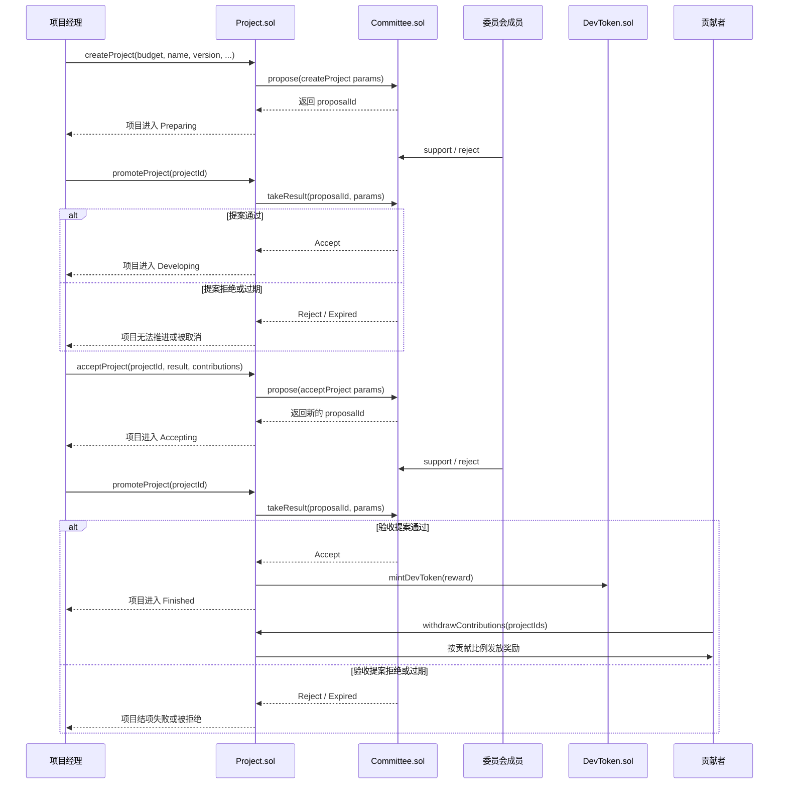
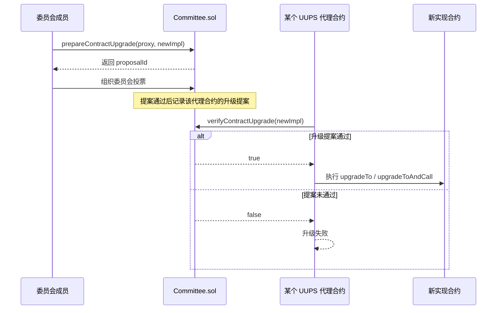

# SourceDAO 架构概览

这份文档从当前仓库里的主实现出发，概述 SourceDAO 的模块边界、治理流程和运行闭环。

当前应优先以 `contracts/` 目录为准理解系统。`old_contracts/`、部分 `scripts/` 和部分 `test/` 文件中保留了历史阶段的命名与流程，阅读时应与当前主架构区分开。

## 1. 系统定位

SourceDAO 不是一个单纯的投票系统，而是一套面向开源组织的链上治理与激励框架。它试图把以下几类行为整合到一组协作合约中：

- 委员会治理
- 全员投票
- 开源项目立项与验收
- 贡献奖励发放
- 双代币分层权益
- 投资锁仓与线性释放
- 收益分红
- 合约升级治理

## 2. 模块划分

### 主控层

- `Dao.sol`：系统总注册表，保存各模块地址，并提供 `isDAOContract` 用于限制内部模块调用权限。
- `SourceDaoUpgradeable.sol`：统一的 UUPS 升级基类，所有主模块共用升级授权逻辑。

### 治理层

- `Committee.sol`：治理核心，负责普通提案、全员提案、委员会成员管理、DevToken 权重调整以及合约升级授权。

### 生产层

- `Project.sol`：项目生命周期管理，包括立项、开发、验收、贡献登记、奖励结算。

### 资产层

- `DevToken.sol`：贡献型 Token，受限流转，只能沿受控路径移动。
- `NormalToken.sol`：流通型 Token，可自由流转，由 DevToken 1:1 转换而来。
- `TokenLockup.sol`：前期投资和资本合作的锁仓与释放模块。
- `Dividend.sol`：质押与分红模块。
- `Acquired.sol`：使用外部资产收购 DAO NormalToken 的模块。

## 3. 模块关系图

## 4. 关键治理原则

### 提案分两层

- 普通提案：委员会成员投票，多数决。
- 全员提案：按 Token 权重投票，NormalToken 按 1:1 计票，DevToken 按 `devRatio` 加权。

### 项目不是“直接执行”，而是“提案驱动”

项目立项和项目验收都不是项目经理单方面完成，而是先发起提案，再由治理结果驱动状态迁移。

### 升级不是 owner 权限，而是治理权限

所有主模块都继承统一升级基类，升级前必须经过委员会升级提案验证。

### DevToken 与 NormalToken 分工明确

- DevToken 代表贡献权益。
- NormalToken 代表可流通权益。
- DevToken 不能像普通 ERC20 那样自由交易。

## 5. 项目治理时序图

下面这条时序图描述的是 SourceDAO 最核心的业务闭环：一个开源项目如何从立项走到验收，再走到奖励结算。

## 6. 正式版发布后的联动

某个主项目正式版发布后，系统会触发一组制度上的收敛：

- `TokenLockup.sol` 可以开始按 6 个月线性释放已锁定的 Token。
- `Committee.sol` 中的 DevToken 权重会向最终值收敛，并在最终版本发布后固定。
- 锁仓合约不再适合继续接收新的锁仓批次。

这意味着 SourceDAO 不是静态治理，而是把“从早期建设到正式发布”的组织阶段差异写进了合约。

## 7. 升级治理时序图

除了项目治理，升级治理也是 SourceDAO 的关键机制。

## 8. 阅读建议

推荐按下面顺序继续深入：

1. `docs/NewSourceDao.md`
2. `contracts/Dao.sol`
3. `contracts/Committee.sol`
4. `contracts/Project.sol`
5. `contracts/DevToken.sol`
6. `contracts/TokenLockup.sol`
7. `contracts/Dividend.sol`